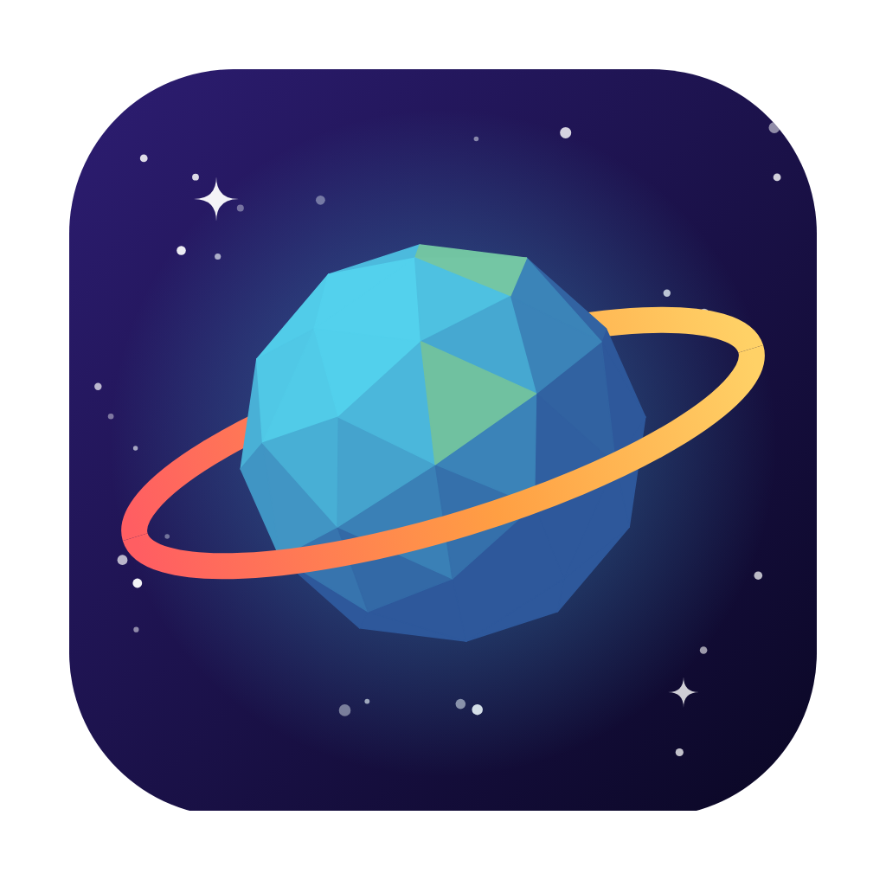
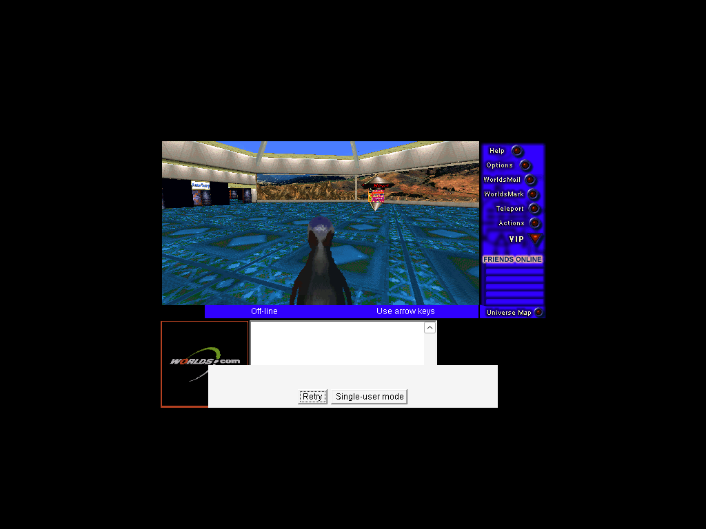
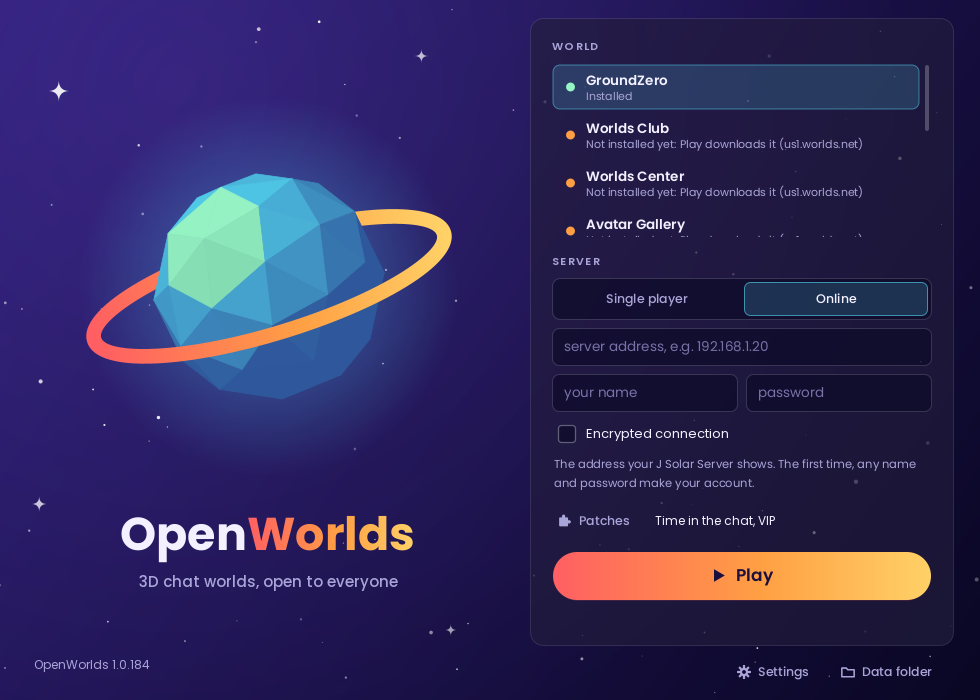
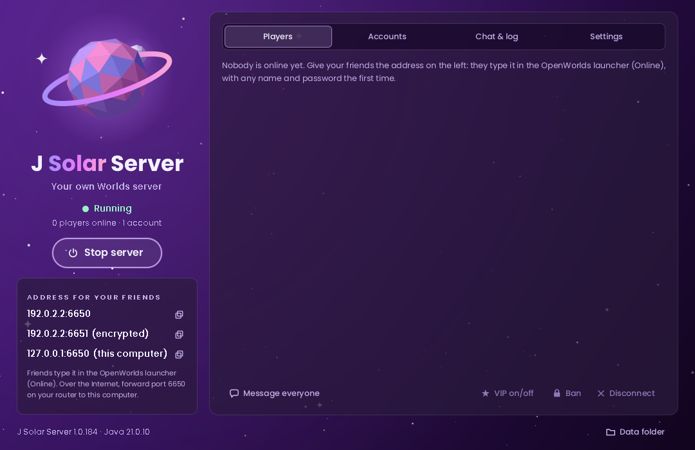
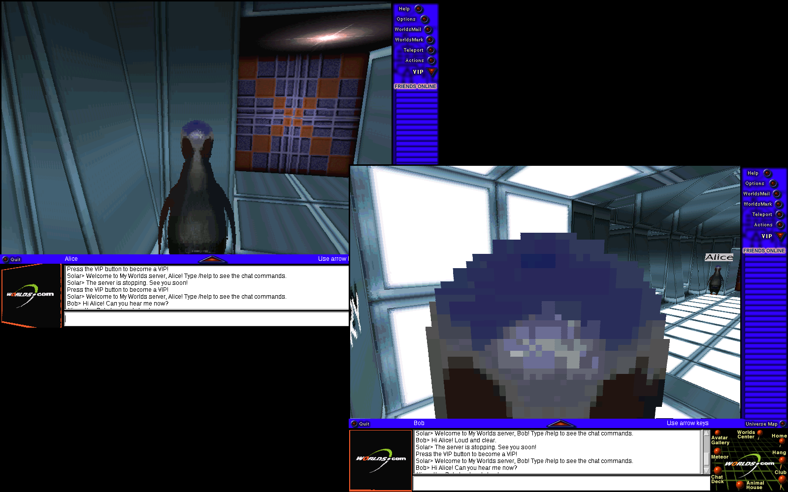

<p align="center">
  
</p>

<h1 align="center">OpenWorlds</h1>

<p align="center">
  <b>Worlds Chat / WorldsPlayer, the 3D chat of 1995-2004, playable again on today's computers.</b><br>
  The original 2004 client, running unchanged on a re-implementation of its engine,<br>
  with a launcher, a world server of its own and patches to choose from.
</p>

<p align="center">
  <a href="https://github.com/luc4sterly/OpenWorlds/releases/latest">Download</a> ·
  <a href="docs/game-tests.md">What works</a> ·
  <a href="docs/worlds-chat-project.md">Project history</a>
</p>



Worlds Chat (Worlds Inc.) was one of the first social 3D chat programs:
avatars walking around rooms and worlds, talking in text. Its last client,
WorldsPlayer, is Java with a native engine for Windows (RenderWare 2.1,
called through JNI from `gamma.dll`), and its servers and websites have long
been gone. OpenWorlds decompiles it and translates its native code to Java,
so the same 2004 program runs on macOS, Linux and Windows without Wine, and
adds what is needed to play it today.

## What is in it

| | |
|---|---|
| **OpenWorlds** (the launcher) | Pick a world and press Play. Worlds that are not installed are downloaded first from the LibreWorlds mirror of the old upgrade server. Play alone, or online on a J Solar Server, optionally encrypted. Updates itself from the GitHub releases. |
| **J Solar Server** | A world server you run yourself, so friends meet in the same worlds: they see each other walk, chat, whisper, keep friends lists, can be VIPs. Accounts, guests, bans, admin commands, encrypted connections (TLS), and a window anyone can use, or a console. |
| **J Worlds Injector** | Patches for the 2004 game, ticked in the launcher and built into it when the game starts: VIP features, walk faster, the time on each chat line, no word filter, encrypted connection. Write your own as plain diffs. |

<p align="center">
  
  
</p>



## Playing

Download the package for your system from the
[latest release](https://github.com/luc4sterly/OpenWorlds/releases/latest):
the apps bring their own Java; the portable packages need Java 17 or newer.

- **OpenWorlds**: open it, pick a world, press **Play**. "Single player"
  needs nothing else; "Online" needs the address of a J Solar Server (the
  first time, any name and password make your account there).
- **J Solar Server**: open it on one computer and give your friends the
  address its window shows (forward ports 6650 and 6651 on your router for
  friends on the Internet).

The apps are not signed by Apple: on macOS, the first time, allow them in
System Settings > Privacy & Security ("Open Anyway"), or run
`xattr -dr com.apple.quarantine OpenWorlds.app`. Package READMEs:
[OpenWorlds](tools/dist-README.txt), [J Solar Server](tools/dist-README-server.txt).

## How it works

```
2004 client (decompiled Java, NET.worlds.*, never edited)
   │  native methods (JNI)
   ▼
portable bridge (Java): gamma.dll, RenderWare 2.1 (RWL21) and its software
rasterizer (RWDL6D21) translated from the binaries, function by function
   │
   ▼
Java 17+ on macOS / Linux / Windows (AWT window, javax.sound...)
```

- `editor/worldsplayer_source_editor-main/source/` — the decompiled client
  (Vineflower), left as it is; `bridge/` — the translated native layer and
  the build-time patches that wire it in (`build_gamma.sh`).
- `decompiled-native/` — Ghidra output of every native binary of the game
  (gamma.dll, RenderWare and its drivers, the 2004 updater and launcher):
  the evidence each translation is checked against.
- `formats/` — readers for the game's own formats (`.bod`, `.seq`, `.rwg`,
  `.cmp`/`.mov`), verified against the whole surviving corpus.
- `launcher/`, `server/`, `injector/`, `ui/` — the launcher, J Solar
  Server, J Worlds Injector and their shared look.
- `docs/` — a reference per file format, the network protocol as the
  client needs it ([`net-local-server.md`](docs/net-local-server.md)),
  everything tested in the game ([`game-tests.md`](docs/game-tests.md)),
  the [roadmap](docs/roadmap.md) and the full
  [project history](docs/worlds-chat-project.md).

## Building

Needs a JDK 17 or newer (21 recommended), `patch` and `zip`; on Linux
without a display, `xvfb`.

```bash
tools/setup-linux.sh                   # or tools/setup-macos.sh: JDK and the first build
tools/build-dist.sh                    # build/dist/OpenWorlds and build/dist/JSolarServer, plus portable .zip files
tools/build-dist.sh --app-image        # also this system's apps with their own Java
xvfb-run -a tools/run-checks.sh        # every check (formats, bridge, injector, launcher, server)
tools/verify-corpus.sh                 # the format readers against the real files
```

The CI (`.github/workflows/build.yml`) builds and tests every push, makes
the apps for macOS (Intel and Apple Silicon), Windows and Linux, runs the
packaged game under Xvfb (it must draw, and connect over TLS to the
packaged server), and publishes a release for every push to `main`.

## Writing a patch

A patch is a folder with a `patch.properties` (`name`, `description`,
`category`) and one or more unified diffs against the client's source as
the bridge builds it (`editor/.build-gamma/source/` after `build_gamma.sh`,
or `lib/worldsplayer-src.zip` in a package). Put it in the `patches`
folder of the launcher's data folder and it shows up in the Patches
window. Examples: [`injector/patches/`](injector/patches).

## Thanks

- The **Whirlsplash** project, whose source editor (`editor/`) decompiles
  and recompiles the client, and **LibreWorlds**, for the documented
  protocol (`protocol/LibreWorlds-wiki-master/`) and the mirror of the old
  upgrade server that still serves the worlds.
- [Vineflower](https://github.com/Vineflower/vineflower) and
  [Ghidra](https://ghidra-sre.org/), and the
  [Poppins](https://fonts.google.com/specimen/Poppins) font (SIL Open Font
  License) the apps use.

Worlds Chat, WorldsPlayer and Worlds.com are trademarks of Worlds Inc.
OpenWorlds is an unofficial project, not affiliated with or endorsed by
Worlds Inc.
